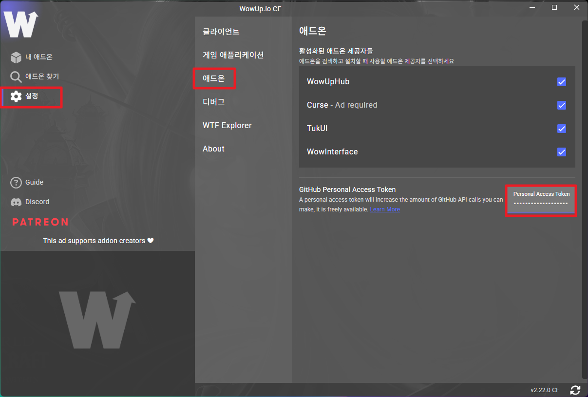
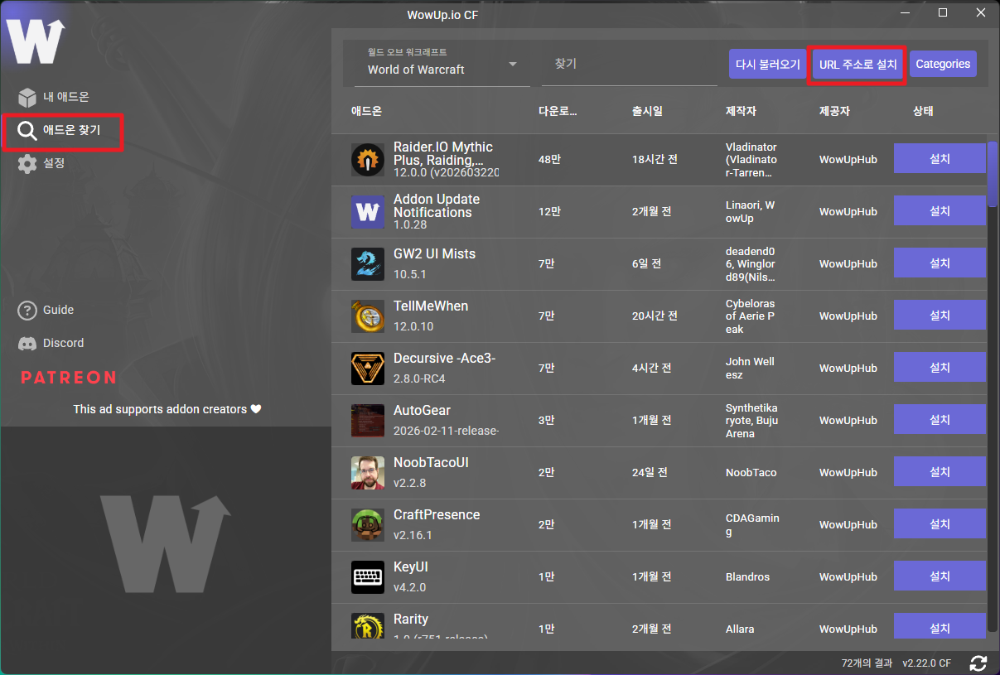
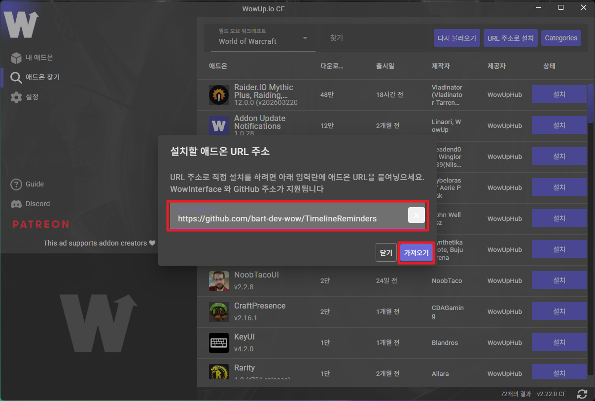
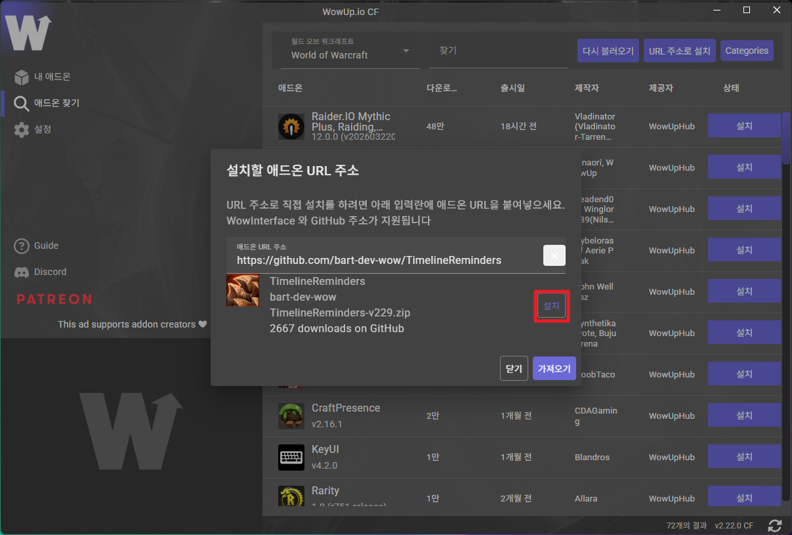
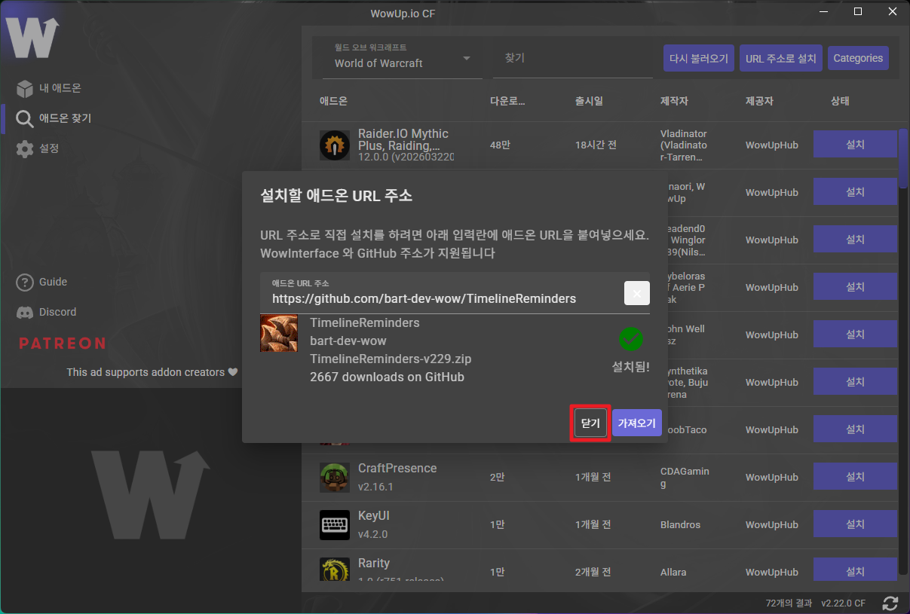
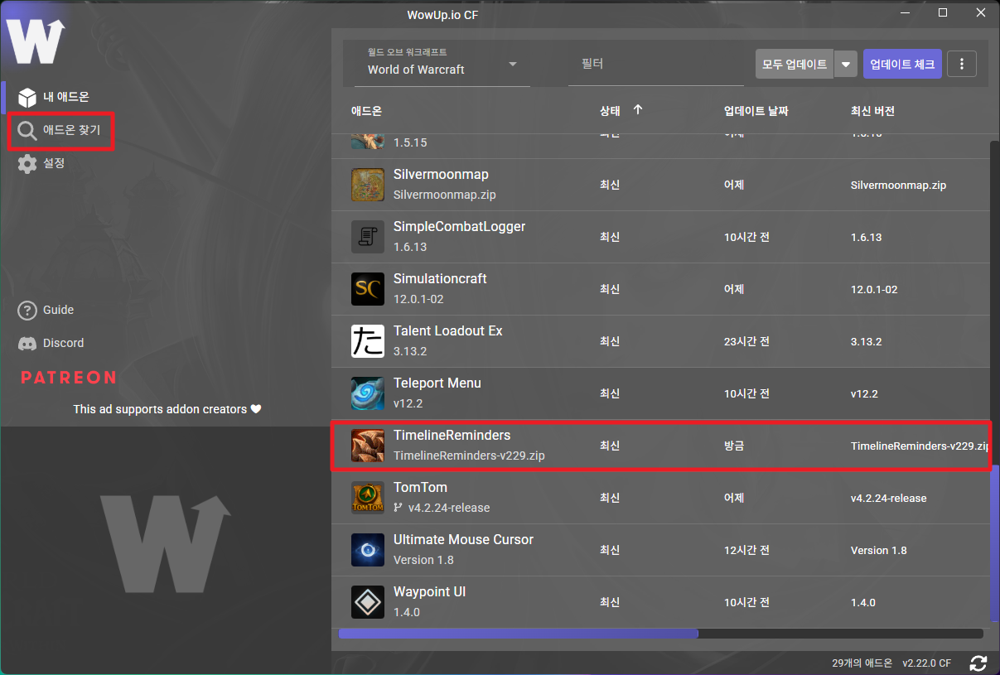

# WowUp을 통한 Timeline Reminders 애드온 설치

- **Created At:** 2026-03-23
- **Updated At:** 2026-03-23

### 1. WowUp에서 `설정` > `애드온` > `Personal Access Token`에 전달받은 토큰 입력



### 2. `애드온 찾기` > `URL 주소로 설치` 버튼 클릭



### 3. `설치할 애드온 URL 주소`에 아래 URL 주소 입력 후 `가져오기` 클릭
```
https://github.com/bart-dev-wow/TimelineReminders
```


### 4. 화면과 같이 뜨면 `설치` 버튼 클릭



### 5. `설치됨!`이 뜨면 `닫기` 버튼 클릭



### 6. 좌측 `내 애드온` 메뉴 클릭 후 `TimelineReminders` 정상 설치 확인

